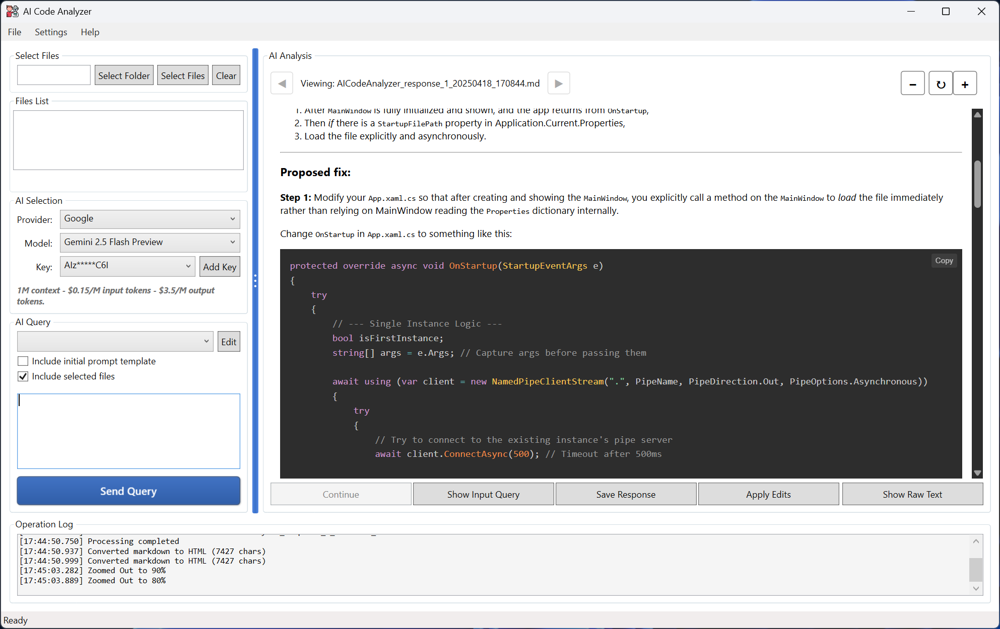

# AI Code Analyzer

  
*A powerful tool for analyzing codebases using various AI models.*

## Table of Contents

- [Overview](#overview)
- [Features](#features)
- [Prerequisites](#prerequisites)
- [Installation](#installation)
- [Usage](#usage)
- [Configuration](#configuration)
- [API Keys Management](#api-keys-management)
- [Contributing](#contributing)
- [License](#license)
- [Contact](#contact)

## Overview

AI Code Analyzer is a desktop application built with .NET and WPF that allows developers to scan and analyze their codebases using multiple AI providers (e.g., Claude, ChatGPT, DeepSeek, Grok, and Gemini). It helps identify bugs, security vulnerabilities, code quality issues, and suggests improvements. The app is designed for ease of use, with features like file selection, token estimation, and response history navigation.

This project is ideal for developers working on large codebases who want to leverage AI for code reviews without manually integrating APIs.

## Features

- **Codebase Scanning**: Select folders or individual files to analyze, with support for common extensions (e.g., .cs, .js, .py).
- **AI Integration**: Supports multiple providers including OpenAI, Claude, Gemini, DeepSeek, and Grok for flexible analysis.
- **Token Estimation**: Calculates estimated tokens for API requests to help manage costs and limits.
- **Prompt Customization**: Users can create, edit, and select custom prompt templates for analysis.
- **Response Management**: View, navigate, and save AI responses, with options to edit and regenerate content.
- **File Association**: Option to register the app as the default handler for .md files.
- **Recent Files Tracking**: Quickly reopen recently analyzed files.
- **Error Logging**: Built-in logging for debugging and error handling.
- **User-Friendly Interface**: WPF-based UI with features like zoom controls and markdown viewing.

## Prerequisites

- **Operating System**: Windows 10 or later (due to WPF and Windows API dependencies).
- **.NET SDK**: Version 9.0 or later. Download from [here](https://dotnet.microsoft.com/download/dotnet/9.0).
- **Dependencies**: The project uses the following NuGet packages:
    - Markdig (for Markdown rendering)
    - SharpToken (for token counting)
    - MessagePack (for serialization)
    - Microsoft.WindowsAPICodePack-Shell (for file dialogs)
- **AI API Access**: You'll need API keys from providers like OpenAI, Anthropic (Claude), Google (Gemini), etc. Sign up on their respective websites.

## Installation

Download the application on the release page.

Extract the zipped file into your desired folder.

This application requires administrative access.

Configure API keys via the app's settings (see [Configuration](#configuration)).

## Usage

1. **Launch the App**.
2. **Select Files/Folder**:
    - Click "Select Folder" to scan an entire project directory.
    - Or use "Add Files" to select specific files.
    - The app filters files based on configured extensions and size limits.
3. **Configure AI Settings**:
    - Choose an AI provider from the dropdown.
    - Select a model (if supported) and an API key.
4. **Set Up Prompt**:
    - Select a prompt template or create a custom one.
    - Optionally include the template or selected files in the query.
5. **Send Query**:
    - Enter any follow-up questions and click "Send Query".
    - View the AI response in the main panel, with options to navigate, save, or edit.
6. **Save and Manage Responses**:
    - Use the "Save Response" button to export results.
    - Access recent files from the menu for quick loading.

## Configuration

- **Access Settings**: Go to the "File" menu and select "Configure...".
- **Prompt Templates**: Add, rename, or delete templates in the "Prompt Settings" tab.
- **File Extensions**: Manage which file types are scanned in the "File Settings" tab.
- **File Association**: Enable to set the app as the default for .md files.
- **API Keys**: Add and manage keys in the "API Keys" tab. Keys are stored securely in a local file.

## API Keys Management

API keys are handled securely within the app:
- Stored in an encrypted binary file (`keys.dat`) using MessagePack serialization.
- Access keys via the configuration window.

## License

This project is licensed under the GPL-3.0 License.

## Contact

- **GitHub**: [drpetersonfernandes](https://github.com/drpetersonfernandes)
- **Website**: [purelogiccode.com](https://www.purelogiccode.com)

Thank you for using AI Code Analyzer! If you encounter any issues, please report them on the GitHub issues page.

⭐ If you find this tool helpful, please consider giving it a star on GitHub! Your support helps the project grow. ⭐

---